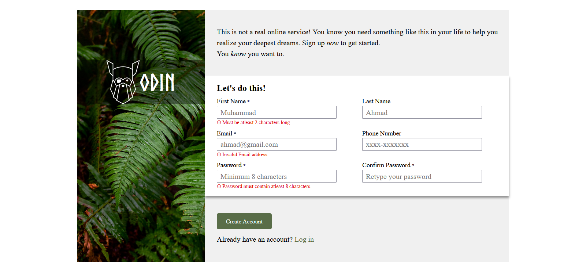

# Sign-up Form

This project is a solution to the [Sign-up Form assignment](https://www.theodinproject.com/lessons/node-path-intermediate-html-and-css-sign-up-form) from [The Odin Project](https://www.theodinproject.com/). It demonstrates HTML and CSS skills by building a fully responsive sign-up form with client-side validation.

## Features

- Responsive layout using CSS Grid and Flexbox
- Modern CSS features including `clamp()` for fluid typography
- Custom styling with Josh Comeau's CSS Reset
- Interactive form validation:
  - Real-time validation feedback with error messages
  - Custom validation patterns for:
    - Names (minimum 2 characters)
    - Phone number (format: xxxx-xxxxxxx)
    - Password (minimum 8 characters)
    - Password matching validation using JavaScript
- Semi-transparent overlay with logo on the sidebar image
- Accessible form with required field indicators
- Mobile-first design with breakpoints at 960px and 580px

## Preview



## Getting Started

1. **Clone the repository:**
   ```bash
   git clone <repo-url>
   cd sign-up-form
   ```
2. **Open `index.html` in your browser.**

No build steps or dependencies are required.

## Project Structure

```
sign-up-form/
│
├── index.html          # Main HTML structure
├── styles.css          # CSS styles including responsive design
├── script.js          # Form validation JavaScript
│
└── assets/
    ├── desktop_preview.png
    ├── form_cover_photo.jpg
    ├── Norse-Bold.otf
    └── odin_logo.png
```

## Technical Details

### CSS Features
- CSS Grid for page layout
- Flexbox for form components
- Fluid typography using `clamp()`
- Custom form validation styles
- Mobile responsive breakpoints
- Semi-transparent overlay implementation

### JavaScript Features
- Real-time input validation
- Custom password matching validation
- Error message visibility toggling
- Form submission handling

### Responsive Design
- Desktop-first with mobile breakpoints:
  - < 960px: Stack layout for smaller screens
  - < 580px: Single column form fields

## Credits

- **CSS Reset:** [Josh Comeau's Custom CSS Reset](https://www.joshwcomeau.com/css/custom-css-reset/)
- **Background Image:** [Unsplash - Halie West](https://unsplash.com/photos/25xggax4bSA)
- **Logo Font:** [Norse Bold](https://cdn.statically.io/gh/TheOdinProject/theodinproject/efdc2888072f409e687d31dc580595dbe4fe0ff4/app/assets/fonts/Norse-Bold.otf)
- **Odin Logo:** [The Odin Project](https://www.theodinproject.com/)

## License

This project is for educational purposes as part of The Odin Project curriculum.